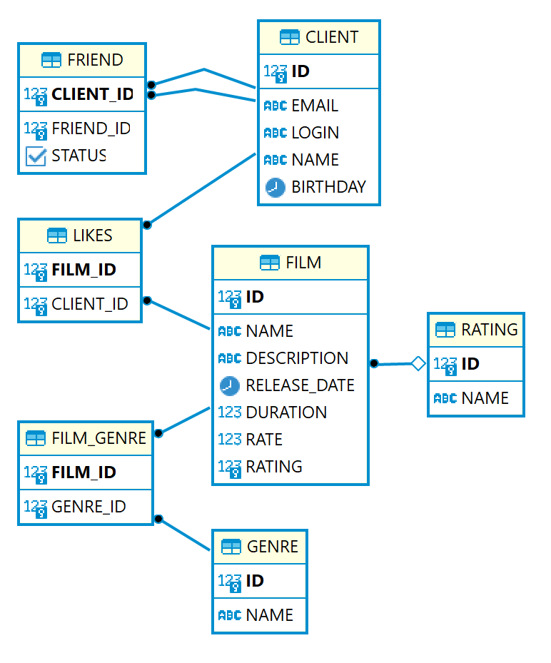

# java-filmorate
Template repository for Filmorate project.


В таблице Friends хранятся данные о заявках в дурзья и их статусах (принял/не принял).
У нее составной первичный ключ (user_id, friend_id), один внешний ключ (user_id).

__Базовые запросы:__

- Получить фильм по ID  
```
SELECT * FROM Film f
Where f.id = 1;
```
- Получить пользователя по ID  
```
SELECT * FROM User u
Where u.id = 1;
```
- Получить жанр фильма 
```
SELECT f.name, g.name FROM Film f
LEFT JOIN Genre g ON f.genre=g.genre_id
Where f.id = 1;
```
- Получить рейтинг фильма 
```
SELECT f.name, r.name FROM Film f
LEFT JOIN Rating r ON f.rating=r.rating_id
Where f.id = 1;
```
- Получить статус дружбы
```
SELECT f.status
  FROM Friends f
  Where f.user_id = 3;
```
- Получить информауию о дружбе пользователя (id = 3) с другими пользователями 
```
SELECT *
  FROM Friends f
  Where f.user_id = 3;
```